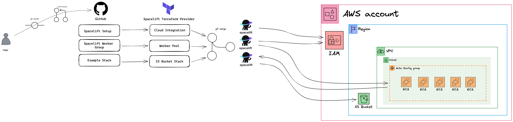

# Spacelift Cloud Integration Setup

This repository contains example Terraform codes for creating a Cloud Integration setup for AWS within Spacelift.

You can run this Terraform code on Spacelift with creating a Stack and connecting this repository to your Spacelift.

